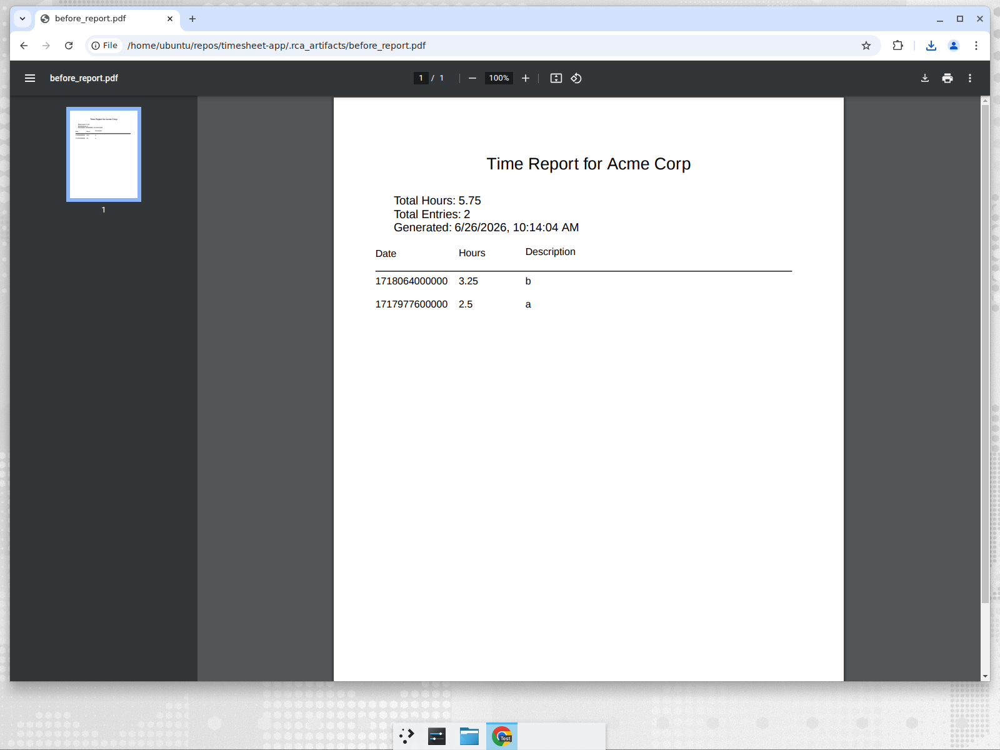

# Root Cause Analysis: Exported reports show raw timestamps instead of dates

## Summary

The most impactful bug in the application is that **work-entry dates are persisted as
Unix epoch‑millisecond integers instead of calendar dates.** Every value in the `date`
column ends up looking like `1718064000000` rather than `2024-06-11`.

This silently corrupts the application's headline feature — **CSV and PDF report
exports** — where the `Date` column renders the raw millisecond number, making exported
timesheets unreadable for the people who actually consume them (clients, finance, etc.).
It also breaks the documented API contract (`date: string`) by returning numbers.

| | Before | After |
|---|---|---|
| PDF / CSV `Date` column | `1718064000000` | `2024-06-11` |
| `GET /api/reports/client/:id` → `workEntries[].date` | `1718064000000` (number) | `"2024-06-11"` (string) |

### Before


### After


CSV samples are also included: [`docs/rca/before_report.csv`](docs/rca/before_report.csv)
vs [`docs/rca/after_report.csv`](docs/rca/after_report.csv).

---

## How it was found

Created a client and two work entries (`2024-06-10`, `2024-06-11`) and exercised every
feature. The web UI looked fine, but the data layer told a different story:

```
$ curl .../api/reports/client/1 | jq '.workEntries[].date'
1718064000000
1717977600000

$ curl .../api/reports/export/csv/1
Date,Hours,Description,Created At
1718064000000,3.25,b,2026-06-26 10:12:41
1717977600000,2.5,a,2026-06-26 10:12:41
```

## Root cause

The work-entry validation schemas declared `date` with Joi's date type:

```js
// backend/src/validation/schemas.js
const workEntrySchema = Joi.object({
  ...
  date: Joi.date().iso().required()        // <-- coerces to a JS Date object
});
```

By default `Joi.date()` **coerces** the validated value into a JavaScript `Date`
object. The route then binds that `Date` straight into SQLite:

```js
// backend/src/routes/workEntries.js
const { clientId, hours, description, date } = value; // date is now a Date object
db.run('INSERT INTO work_entries (..., date) VALUES (?, ?, ?, ?, ?)',
       [clientId, req.userEmail, hours, description || null, date]);
```

The `node-sqlite3` driver does not have a native date type, so when it receives a
`Date` bound parameter it stores its **numeric `.getTime()` value** — the epoch in
milliseconds. The column is declared `DATE`, but SQLite's dynamic typing happily stores
the integer, so there is no error. From then on the value is a number everywhere it is
read back.

### Why the UI hid the bug

The React tables render dates with `new Date(entry.date).toLocaleDateString()`. Because
`new Date(1718064000000)` is a perfectly valid date, the dashboard, work-entries and
reports pages all *looked* correct. The corruption only became visible in the exports,
which write the raw value:

```js
// CSV: csv-writer writes the raw field value -> "1718064000000"
// PDF: doc.text(entry.date.toString()) -> "1718064000000"
```

So the bug lived in production-facing artifacts (the files customers receive) while
being invisible during normal in-app use — the worst place for it to hide.

## The fix

Keep the ISO‑8601 validation, but tell Joi to return the **original string** instead of
a coerced `Date`, using `.raw()`:

```js
// backend/src/validation/schemas.js
date: Joi.date().iso().raw().required()   // workEntrySchema
date: Joi.date().iso().raw().optional()   // updateWorkEntrySchema
```

`.raw()` runs the exact same validation (invalid input such as `01/15/2024` is still
rejected with `"date" must be in ISO 8601 date format`) but yields the un-coerced input
value. The frontend already sends date-only `YYYY-MM-DD` strings, so the `DATE` column
now stores `"2024-06-11"`, the API returns a string matching its TypeScript contract,
and CSV/PDF exports render real dates.

This is a two-line, root-cause fix at the single point where the type was being
corrupted, rather than papering over it by reformatting at every read site (reports
route, CSV writer, PDF writer, three React pages).

### Verification

- `GET /api/reports/client/:id` now returns `"2024-06-11"` (string).
- CSV and PDF exports show calendar dates (see screenshots above).
- Invalid date formats are still rejected (validation unchanged).
- All **161** existing backend tests pass; frontend `eslint` and `tsc -b && vite build`
  pass.

---

## Other observations (not fixed in this PR)

These were noticed while exploring and are documented for follow-up; they are lower
impact than the export corruption above.

1. **Foreign-key cascade is never enforced.** The schema declares
   `ON DELETE CASCADE`, but SQLite ignores foreign keys unless `PRAGMA foreign_keys = ON`
   is set per connection (it is not, in `database/init.js`). Deleting a client therefore
   leaves orphaned `work_entries` rows. They are hidden today only because list/report
   queries `JOIN clients`, so orphans silently disappear from results while remaining in
   the table.

2. **Timezone off-by-one risk on the frontend.** `WorkEntriesPage` saves dates with
   `formData.date.toISOString().split('T')[0]`. For users in positive-UTC timezones,
   local midnight converts to the previous day in UTC, so the stored calendar date can
   be off by one. The reciprocal display path
   (`new Date('YYYY-MM-DD').toLocaleDateString()`) can show the previous day in
   negative-UTC timezones. Not reproducible on this UTC host, but worth fixing with a
   timezone-safe date formatter.

3. **Docs vs. implementation mismatch.** The README describes JWT-based auth, but the
   running app authenticates via a plain `x-user-email` header
   (`backend/src/middleware/auth.js`). Harmless functionally, but misleading.
