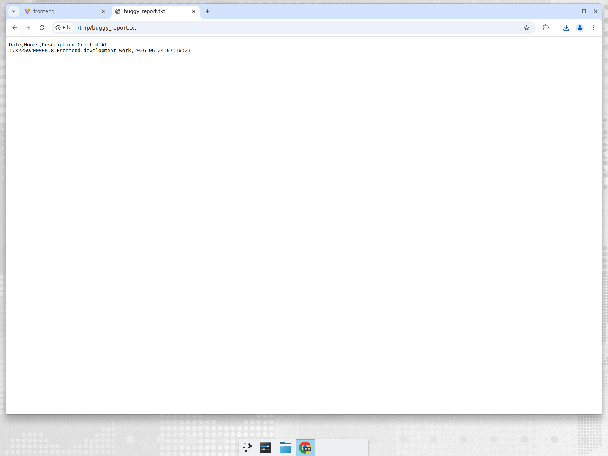
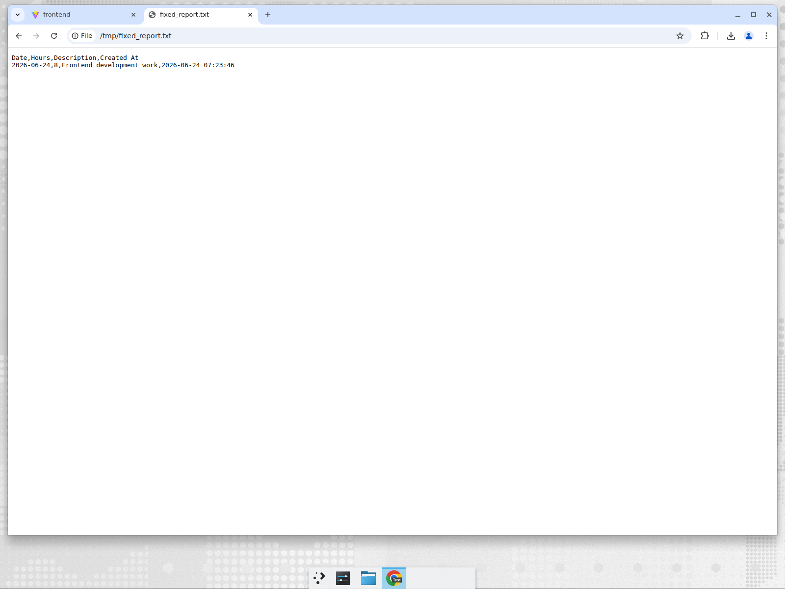
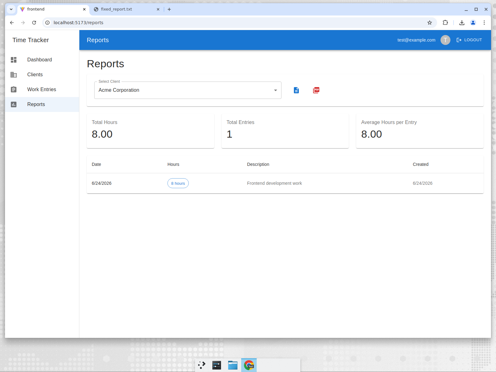

# Root Cause Analysis: Date Fields Stored as Epoch Milliseconds

## Bug Summary

Work entry dates are stored in SQLite as epoch milliseconds (e.g., `1782259200000`) instead of human-readable ISO date strings (e.g., `2026-06-24`). This causes **CSV and PDF report exports to display raw numeric timestamps** instead of formatted dates, rendering exported reports unusable for date-related analysis.

## Impact

- **CSV exports** contain epoch milliseconds in the Date column (e.g., `1782259200000,8,Frontend development work,...`)
- **PDF exports** print raw epoch numbers instead of dates in the report table
- **API responses** return dates as numbers, forcing the frontend to rely on `new Date(timestamp)` conversion, which works but is fragile and timezone-dependent
- **Severity**: High - report exports are a core feature and the exported data is incorrect/unusable

## Root Cause

The bug originates in `backend/src/validation/schemas.js`:

```js
// BEFORE (buggy)
const workEntrySchema = Joi.object({
  // ...
  date: Joi.date().iso().required()
});
```

**What happens:**

1. The frontend sends a date as an ISO string: `"2026-06-24"`
2. Joi's `date().iso()` validator **converts** the string into a JavaScript `Date` object
3. The `Date` object is passed to SQLite via the `node-sqlite3` driver's parameterized query
4. `node-sqlite3` serializes `Date` objects as **epoch milliseconds** (e.g., `1782259200000`)
5. SQLite stores this number in the `date` column
6. When queried, SQLite returns the raw number `1782259200000`
7. The CSV writer and PDF generator output this number directly without formatting

**Why the frontend appeared correct:** The frontend happens to call `new Date(entry.date).toLocaleDateString()`, which converts the epoch milliseconds back to a displayable date. This masked the underlying storage bug from in-app users, but the export paths (CSV/PDF) write the raw database value directly.

## The Fix

Changed the Joi validation from `Joi.date().iso()` to `Joi.string().pattern()` to keep dates as strings throughout the pipeline:

```js
// AFTER (fixed)
const workEntrySchema = Joi.object({
  // ...
  date: Joi.string().pattern(/^\d{4}-\d{2}-\d{2}$/).required().messages({
    'string.pattern.base': '"date" must be in YYYY-MM-DD format'
  })
});
```

The same fix was applied to `updateWorkEntrySchema`.

**Why this works:**

1. The frontend sends `"2026-06-24"` (unchanged)
2. Joi validates the format but keeps the value as a **string**
3. SQLite stores `"2026-06-24"` as text in the `date` column
4. Queries return `"2026-06-24"` as a string
5. CSV/PDF exports output the human-readable date correctly
6. The frontend's `new Date("2026-06-24")` still works for display formatting

## Files Changed

| File | Change |
|------|--------|
| `backend/src/validation/schemas.js` | Changed `date` field validation from `Joi.date().iso()` to `Joi.string().pattern(/^\d{4}-\d{2}-\d{2}$/)` in both `workEntrySchema` and `updateWorkEntrySchema` |

## Verification

- All 161 existing backend tests pass
- CSV export now outputs `2026-06-24` instead of `1782259200000`
- PDF export renders proper dates in the report table
- API responses return date strings instead of epoch numbers
- Frontend display remains correct (dates still render properly)

## Screenshots

### Before Fix - CSV Export with Epoch Timestamps


### After Fix - CSV Export with Proper Dates


### Reports Page (working correctly before and after)


## Other Bugs Found During Exploration

1. **SQLite foreign keys not enforced**: `PRAGMA foreign_keys = ON` is never called in `database/init.js`, so `ON DELETE CASCADE` on the `work_entries` table has no effect. Deleting a client leaves orphaned work entries.

2. **README/code mismatch on authentication**: The README describes JWT-based auth with 24-hour token expiration and rate limiting (5 attempts/15 min), but the actual implementation uses a simple `x-user-email` header with no tokens or passwords.

3. **Global rate limiter misconfiguration**: A single rate limiter (100 requests/15 min) applies to all routes, not just authentication endpoints as documented.
